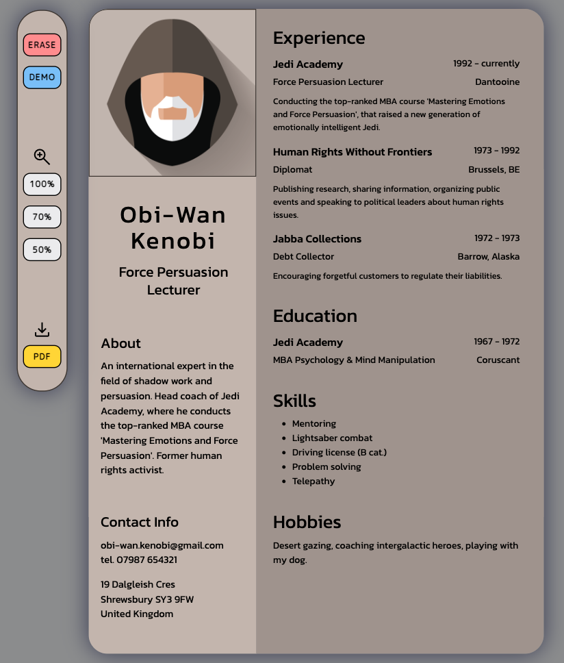

# CV Creator React

[Check live!](https://mrzadzinski.github.io/cv-creator/)

Star Wars themed CV creator with demo data to play with.

## Features
* Add / remove / modify personal info
* Upload photo
* Demo mode / erase data
* Scaling buttons (100%, 70%, 50%)
* Download CV in PDF (using html2canvas & jspdf)

## Technologies
* React
* JSX
* Javascript
* SCSS

## Skills practiced
* React app architecture - my first react app
* Working with class components
* Usage of props and state
* Dealing with unidirectional data flow
* JSX syntax
* Conditional rendering

## Acknowledgments
* This project was an assignment from The Odin Project course: [CV Application](https://www.theodinproject.com/lessons/node-path-javascript-cv-application)
